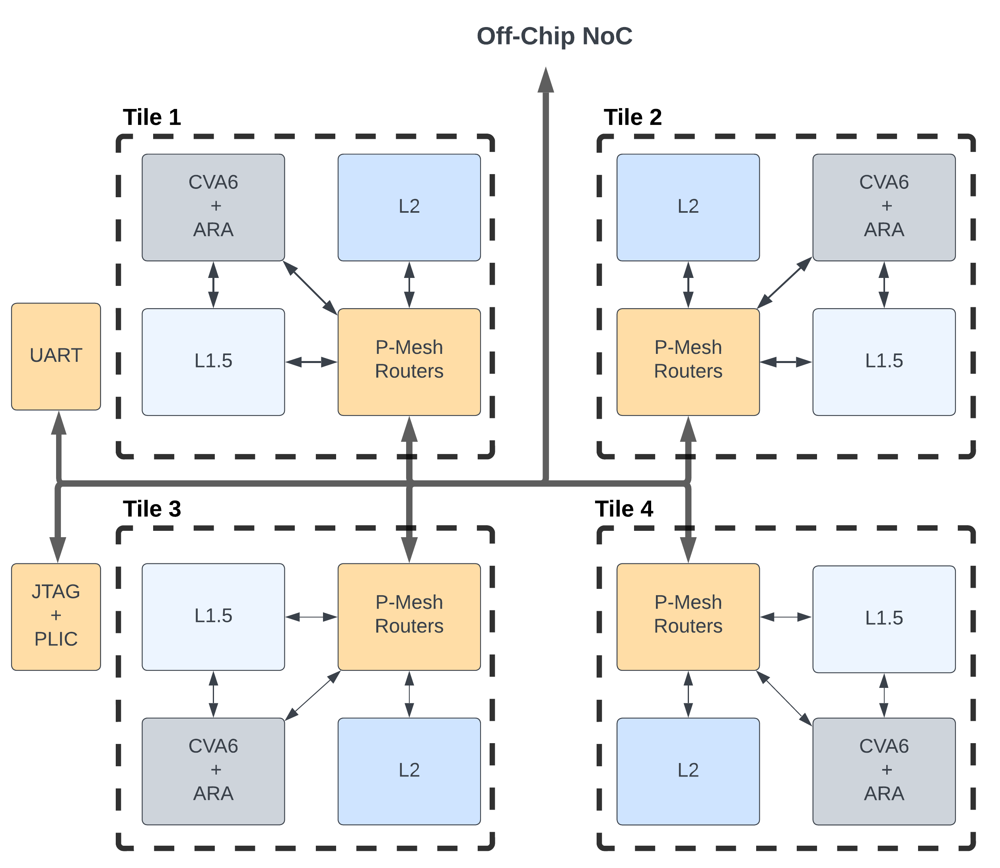

## CORE-V Polara APU

CORE-V Polara APU originated from [Ara](https://github.com/pulp-platform/ara)[1] and [Openpiton](https://github.com/PrincetonUniversity/openpiton)[2] projects. CORE-V Polara APU, AKA Polara, has 4 RISC-V vector cores (Ara) connected together using OpenPiton platform. Figure below shows the top-level diagram of Polara. 

<!-- . -->

Polara is also equipped with low precision computation for DNN inferece. Please refer to [3] for more details. In case you would be interested to join the project please feel free to open an issue, or involve yourself in any open issues/discussions. Contributions are always welcome! First time contributors should review the Contributing guide [TODO].

## Building

Polara project is hosted at OpenHW github repository. You first need to clone the repository as described below:

    cd [YOUR_PROJECT_DIR]
    git clone https://github.com/openhwgroup/core-v-polara-apu.git
    cd core-v-polara-apu

### Pre-requisites

1. RISC-V compiler with vector extension support: To build any binary for Polara, you will need to install RISC-V compiler with vector extension support. We recommend to follow the [steps](https://github.com/pulp-platform/ara#toolchain) provided by Ara project.

2. Acess to simulators: For simulation, Polara has been tested with VCS and Modelsim/Questasim. You will need to have access to one of these simulators. 

### OpenPiton specific env setups. 

Put this inyour `.cshrc` (if you are using bash, use proper bash equivalent):
    
    alias phere 'setenv PITON_ROOT $PWD; source piton/piton_settings.cshrc; setenv ARIANE_ROOT $PITON_ROOT/piton/design/chip/tile/ariane'

Assuming you have access to synopsys tools through CMC (Canadian Microelectronics Corporation), you can run a simple 2x2 tile using the following steps ( first re-load the terminal or create a new tab):

    cd [PITON_TOP_FOLDER]
    phere
    cd build
    source /CMC/scripts/synopsys.vcs_verdi.2022.06-SP2.csh (setup synopsys tool)
    stgcc1120 (setup gcc)
    stgcc1020-rv64vg (setup risc-v gcc cross compiler)
    sims -sys=manycore -x_tiles=2 -y_tiles=2 -vcs_build -ariane -config_rtl=SYNTHESIS -vcs_build_args="-assert svaext +define+VLEN=4096 +define+NR_LANES=4 +define+ARIANE_ACCELERATOR_PORT=1" -vcs_build_args="-LDFLAGS -Wl,--no-as-needed"

This last step, builds the HW for simulation. To run hello world on all cores, run the following:

    sims -sys=manycore -vcs_run -x_tiles=2 -y_tiles=2 hello_world_many.c -ariane -rtl_timeout=500000

## References
1. [Cavalcante, Matheus, et al. Ara: A 1-GHz+ Scalable and Energy-Efficient RISC-V Vector Processor With Multiprecision Floating-Point Support in 22-nm FD-SOI. IEEE Transactions on Very Large Scale Integration (VLSI) Systems 2020.](https://ieeexplore.ieee.org/document/8918510)
2. [Balkind, Jonathan, et al. OpenPiton: An Open Source Manycore Research Framework. In Proceedings of the Twenty-First International Conference on Architectural Support for Programming Languages and Operating Systems (ASPLOS '16).](https://dl.acm.org/doi/abs/10.1145/2954679.2872414)
3. [Askari Hemmat, MohammadHossein, et al. Quark: An Integer RISC-V Vector Processor for Sub-Byte Quantized DNN Inference. 2023 International Symposium on Circuits and Systems (ISCAS 2023).](https://arxiv.org/pdf/2302.05996.pdf)